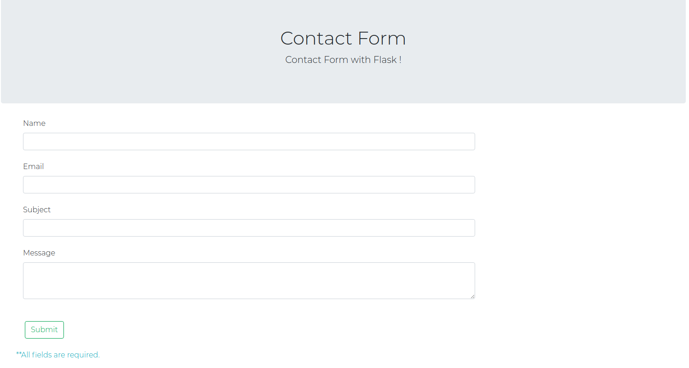

# Contact-form with Flask
Create Contact form with Flask, Flask_wtf and Flask_mail

*Requirements:
----------------------
1. Flask
2. Flask Mail
3. Flask wtf

*How to use:
----------------------
1. Run the routes.py file.
2. Go to your browser and type http://127.0.0.1.5000/form
3. you'll see a contact form.
4. Fill out the form and submit.
5. You'll see a index page with success message " Thanks for you feedback "
